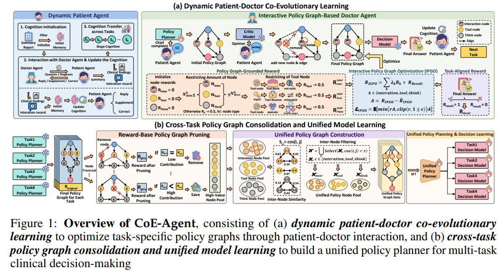

# CoE-Agent: Co-Evolving Patient-Doctor Agents via Interactive Policy Graph Optimization for Clinical Decision Making

## Abstract

Clinical Decision Making (CDM) requires integrating heterogeneous information across sequential diagnostic stages while interacting with patients whose behaviors are often non-stationary and unreliable. However, existing medical agents are typically trained against cooperative patient simulators and tackle each clinical task in isolation, making them fragile to dynamic patient behaviors and unable to capture inter-task dependencies essential for globally coherent decision-making.

To address these issues, we propose **CoE-Agent**, a co-evolving patient–doctor agentic framework that learns globally coherent CDM strategies via interactive policy graph optimization.

First, **Dynamic Patient–Doctor Co-Evolutionary Learning** pairs a Dynamic Patient Agent, which maintains an evolving cognition state to simulate non-stationary behaviors, with an Interactive Policy Graph-Based Doctor Agent that generates DAG-structured policy graphs unifying interactions, tool invocations, and reasoning steps. The doctor agent is then optimized via **Interactive Policy Graph Optimization (IPGO)**, which jointly enforces structural validity and task-aligned correctness through reinforcement learning.

Second, **Cross-Task Policy Graph Consolidation and Unified Model Learning** prunes low-value nodes, aggregates high-value nodes across tasks while filtering redundancy, and distills a unified policy planner with task-specific decision models for globally coherent decision-making.

Experiments on MedChain and ClinicalBench show that CoE-Agent surpasses state-of-the-art baselines by **11.13%** and **23.63%** in average score, while achieving up to **19.5× faster inference**. Source code is to be released.

  

